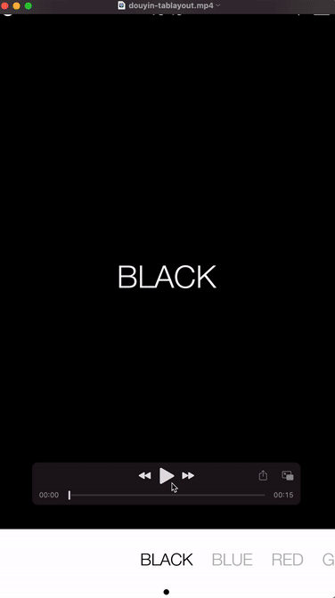

# DouyinTabLayout
a tab layout like douyin app can be scrollable and located at the center anchor

<video id="video" controls="" width="360px" height="480px">
<source id="mp4" src="./app/screen-recoder/douyin-tablayout.mp4">
</video>
